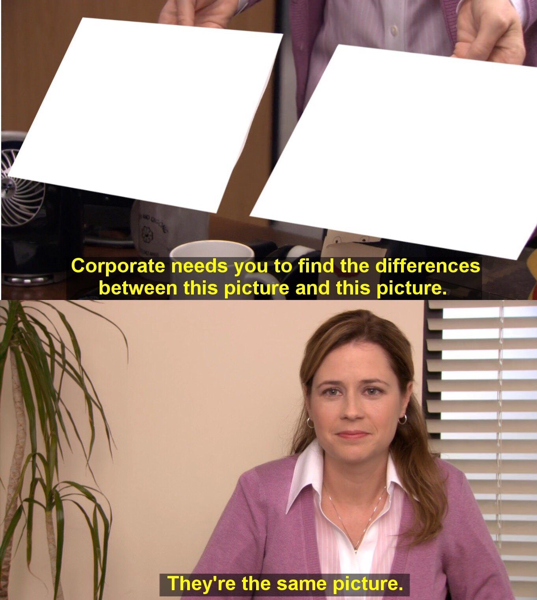

Punto 1

# El problema inicial

  Publicar servicios internos abriendo puertos puede funcionar, pero también amplía la superficie visible hacia Internet.

  Cada regla entrante crea una ruta directa hacia sistemas que antes estaban contenidos dentro de la red interna.

<PreviousSlideButton />
<NextSlideButton />

---
layout: two-cols
---

  
Ruta clásica

  # Modelo tradicional

  <pre class="diagram-card"><code>Internet
   ↓
IP pública
   ↓
Firewall / NAT
   ↓
Puerto abierto
   ↓
Servidor interno</code></pre>

::right::

  
Qué se expone

  # Riesgo principal

  

    <AnimatedList
      :items="[
        'El origen queda visible para cualquiera que lo escanee.',
        'Los bots prueban puertos y rutas de forma constante.',
        'Una regla mal hecha puede publicar servicios sensibles.',
        'Es fácil dejar accesos temporales abiertos más tiempo del debido.',
      ]"
    />
  

<PreviousSlideButton />
<NextSlideButton />

---
layout: center
---

Cambio de enfoque

# El problema no es solo abrir un puerto

  El riesgo real es crear una ruta directa desde Internet hacia infraestructura que fue pensada para operar de forma interna.

  La pregunta correcta deja de ser “qué puerto publico” y pasa a ser “qué superficie expongo”.

<PreviousSlideButton />
<NextSlideButton />

---
layout: two-cols
---

Lo que suele terminar expuesto

# Servicios que suelen exponerse

<pre class="diagram-card"><code>443  → aplicación web
8080 → panel interno
22   → SSH
3389 → RDP
3000 → Grafana
8081 → Keycloak</code></pre>

::right::

Errores frecuentes

# Errores frecuentes

  <AnimatedList
    :items="[
      'Puertos temporales que nunca se cierran.',
      'Paneles internos publicados sin MFA.',
      'Servicios de prueba expuestos como si fueran producción.',
      'Reglas NAT difíciles de auditar con el tiempo.',
      'Aplicaciones internas accesibles desde cualquier lugar.',
    ]"
  />

<PreviousSlideButton />
<NextSlideButton />

---
layout: center
---

Lectura visual del problema

# Señales de mala exposición
 

  

    
    

      
Panel interno sin MFA

      
“Todo bien” aunque el acceso ya quedó demasiado abierto para algo sensible.

    

  

  

    
    

      
Staging tratado como producción

      
Cuando prueba y producción cambian de nombre, pero en exposición terminan siendo lo mismo.

    

  

  

    
    

      
Reglas NAT imposibles de auditar

      
El clásico momento en que nadie entiende ya qué regla abre qué servicio y por qué sigue viva.

    

  

  

    
    

      
Aplicación interna accesible desde cualquier lugar

      
“Tú accedes, tú accedes, todos acceden”, justo lo contrario a segmentar.

    

  

<PreviousSlideButton />
<NextSlideButton />

---
layout: center
---

Lo que cambia

# Qué cambia con Cloudflared Tunnel

  El servidor interno inicia una conexión saliente hacia Cloudflare, en lugar de esperar conexiones entrantes desde Internet.

<pre class="diagram-card"><code>Servidor on-premise
        ↓ conexión saliente
Cloudflare
        ↓
Usuario autorizado</code></pre>

<PreviousSlideButton />
<NextSlideButton />

---
layout: two-cols-header
---

Antes y después

# Comparación rápida

::left::

  <h2>Antes</h2>
  <pre class="diagram-card"><code>Internet
   ↓
IP pública
   ↓
Puerto abierto
   ↓
Servidor interno</code></pre>

::right::

  <h2>Después</h2>
  <pre class="diagram-card"><code>Usuario
   ↓
Cloudflare
   ↓
Tunnel
   ↓
Servicio interno</code></pre>

<PreviousSlideButton />
<NextSlideButton />

---
layout: center
---

Idea clave

# Menos exposición, más control

  Cloudflared Tunnel permite publicar servicios on-premise sin abrir puertos entrantes directamente hacia Internet.

  Publicar no desaparece como necesidad. Lo que cambia es el punto de exposición y el nivel de control.

<PreviousSlideButton />
<NextSlideButton />

---
layout: center
---

Controles adicionales

# Punto importante

  Cloudflared Tunnel no vuelve segura por sí sola a una aplicación vulnerable, pero sí reduce exposición y facilita poner controles encima.

<AnimatedPills
  :items="[
    'Cloudflare Access',
    'MFA',
    'WAF',
    'Políticas por usuario o grupo',
    'Registro de accesos',
  ]"
/>

<PreviousSlideButton />
<NextSlideButton />

---
layout: center
---

Cierre

# Publicar con menos exposición

  No se trata solo de publicar una aplicación. Se trata de publicarla con menos superficie visible y con más control operativo.

  Ese cambio de enfoque es lo que hace que Cloudflared Tunnel resulte tan valioso en entornos on-premise.

<PreviousSlideButton />
<NextSlideButton />
