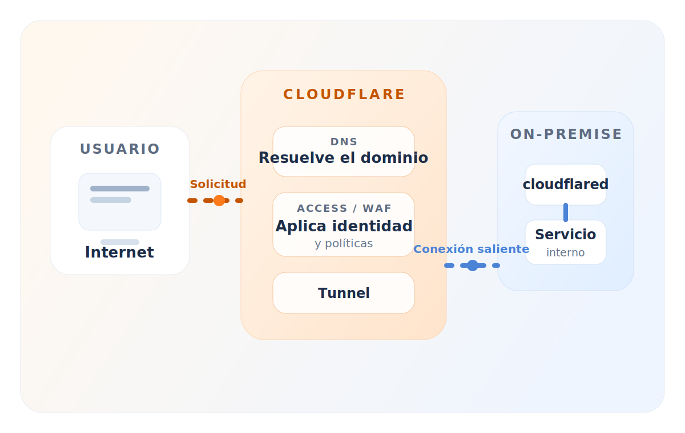
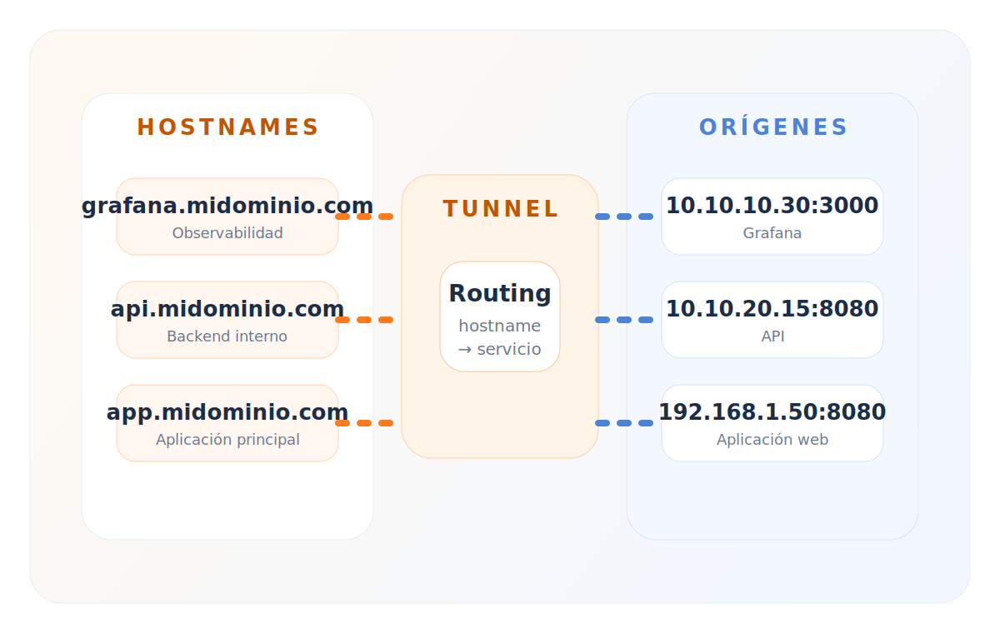
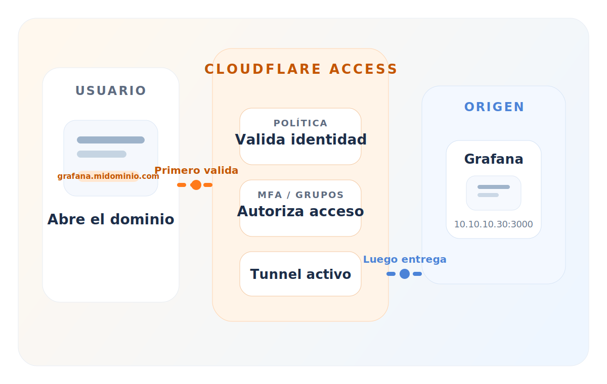

Punto 2

# Arquitectura básica

::left::

  
Qué cambia

  

    Cloudflared Tunnel conecta un servicio interno con Cloudflare usando una conexión saliente iniciada desde la red on-premise.
  

  

    El origen permanece interno. Cloudflare se convierte en la cara pública del acceso y del control.
  

  

    Origen privado
    Salida controlada
    Identidad delante
  

::right::

  
  

    Vista rápida: el usuario entra por Cloudflare y el origen se conecta hacia afuera con <code>cloudflared</code>.
  

<PreviousSlideButton />
<NextSlideButton />

---
layout: two-cols-header
---

Recorrido completo

# Flujo de extremo a extremo

::left::

<pre class="diagram-card"><code>Usuario
   ↓
Cloudflare DNS
   ↓
Cloudflare Access / WAF
   ↓
Cloudflare Tunnel
   ↓
cloudflared
   ↓
Aplicación on-premise</code></pre>

  DNS resuelve
  Access decide
  Tunnel transporta
  cloudflared entrega

::right::

  <AnimatedList
    :items="[
      'El usuario solo ve el dominio público.',
      'Cloudflare recibe primero la solicitud.',
      'Las políticas se aplican antes de tocar el origen.',
      'El tráfico autorizado baja por el túnel hasta el servicio interno.',
    ]"
  />

<PreviousSlideButton />
<NextSlideButton />

---
layout: two-cols
---

  
De cara a Internet

  # Lado público

  

    <AnimatedList
      :items="[
        'El usuario accede al dominio publicado.',
        'Cloudflare recibe la solicitud primero.',
        'Puede aplicar DNS, WAF, Access y otras políticas.',
        'Solo el tráfico válido continúa al túnel.',
      ]"
    />
  

::right::

  
Dentro de la red

  # Lado interno

  

    <AnimatedList
      :items="[
        '`cloudflared` mantiene la conexión saliente viva.',
        'Recibe solicitudes desde Cloudflare.',
        'Las dirige al servicio interno correcto.',
        'La IP privada del origen no queda publicada.',
      ]"
    />
  

<PreviousSlideButton />
<NextSlideButton />

---
layout: two-cols-header
---

Relación hostname → origen

# Cómo enruta el túnel

::left::

  

    El túnel no “expone una red completa”. Expone rutas concretas y cada hostname puede terminar en un destino distinto.
  

  

    <AnimatedList
      :items="[
        'Un dominio público apunta a una intención de acceso.',
        'El túnel decide a qué servicio interno mandar esa solicitud.',
        'Eso permite publicar varias apps sin abrir varios puertos.',
      ]"
    />
  

::right::

  
  

    Ejemplo: distintos hostnames terminan en distintos orígenes internos.
  

<PreviousSlideButton />
<NextSlideButton />

---
layout: two-cols
---

  
Agente on-premise

  # Qué hace `cloudflared`

  

    <AnimatedList
      :items="[
        'Mantiene la conexión con Cloudflare.',
        'Recibe tráfico del túnel.',
        'Lo entrega al servicio interno configurado.',
        'Reporta estado, errores y salud operativa.',
      ]"
    />
  

::right::

  
Qué puede publicar

  # Tipos de servicios

  <pre class="diagram-card"><code>Aplicación web
API
Grafana
Metabase
SSH
RDP
Servidor interno</code></pre>

  

    El patrón es el mismo: hostname público adelante, servicio privado atrás.
  

<PreviousSlideButton />
<NextSlideButton />

---
layout: center
---

Idea clave

# La conexión se inicia desde adentro

<pre class="diagram-card"><code>On-premise
   ↓ conexión saliente
Cloudflare</code></pre>

  No es Cloudflare quien abre una conexión entrante hacia la red interna. El origen sale primero y mantiene esa relación viva.

<PreviousSlideButton />
<NextSlideButton />

---
layout: two-cols-header
---

Caso realista

# Ejemplo práctico: Grafana interno

::left::

  <pre class="diagram-card"><code>Usuario
   ↓
grafana.midominio.com
   ↓
Cloudflare Access
   ↓
Cloudflare Tunnel
   ↓
cloudflared
   ↓
10.10.10.30:3000</code></pre>

  

    El usuario entra por un dominio controlado. El servidor interno sigue siendo privado y solo recibe tráfico que ya pasó los controles.
  

::right::

  
  

    Access valida primero; Tunnel entrega después.
  

<PreviousSlideButton />
<NextSlideButton />

---
layout: two-cols-header
---

Distinción importante

# Tunnel vs Access

::left::

  <h2>Tunnel</h2>
  

    Se encarga de transportar el tráfico entre Cloudflare y el origen interno.
  

  

    <AnimatedList
      :items="[
        'Conecta el servicio.',
        'Evita abrir puertos entrantes.',
        'Resuelve cómo llegar al origen interno.',
      ]"
    />
  

::right::

  <h2>Access</h2>
  

    Se encarga de decidir quién puede pasar antes de tocar el servicio.
  

  

    <AnimatedList
      :items="[
        'Valida identidad.',
        'Puede exigir MFA.',
        'Filtra por grupos, correos o políticas.',
      ]"
    />
  

<PreviousSlideButton />
<NextSlideButton />

---
layout: center
---

Cierre

# Cierre del punto 2

<pre class="diagram-card"><code>Tunnel  → conecta el servicio
Access  → controla el acceso</code></pre>

  El valor aparece cuando ambos trabajan juntos: Tunnel para publicar sin exponer el origen y Access para decidir quién entra.

<PreviousSlideButton />
<NextSlideButton />
